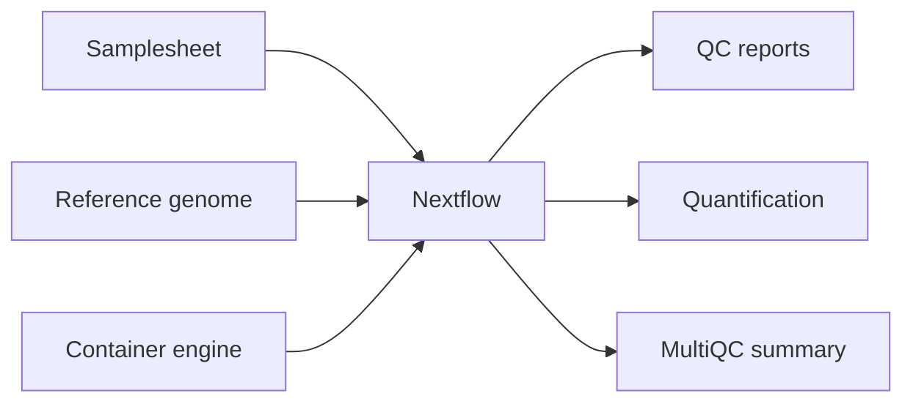

## What you will learn

This tutorial walks through running an nf-core RNA-seq workflow in a reproducible way. It is designed for learners who are comfortable with the command line but new to Nextflow or nf-core.

::: {.callout-tip}
The examples use `nf-core/rnaseq`, but the same structure applies to many nf-core pipelines.
:::

## Tutorial path

1. [Set up your environment](setup.qmd)
2. [Run the pipeline](running.qmd)
3. [Understand the results](results.qmd)
4. [Fix common issues](troubleshooting.qmd)

## Prerequisites

You will need:

- A terminal
- Java
- Nextflow
- A container engine such as Docker, Apptainer, or Singularity
- Enough disk space for reference files, intermediate files, and outputs

## Example workflow

## Citation and credit

This tutorial uses community tools from [nf-core](https://nf-co.re/) and [Nextflow](https://www.nextflow.io/). Update this page with the specific pipeline version, dataset, and citation details used in your workshop.
