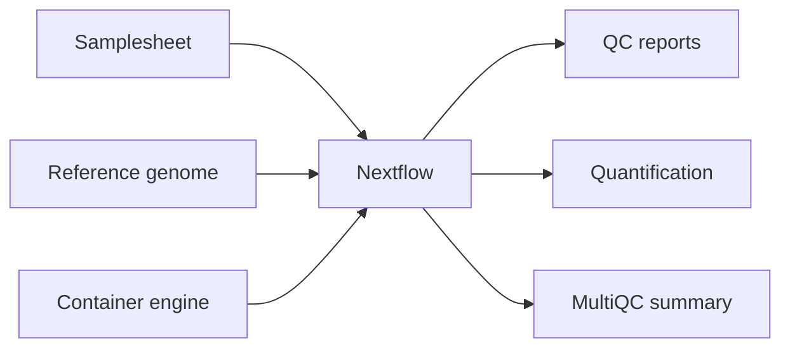

## About this resource

This website is a bioinformatics resource for Mangiamele Lab members learning to do RNA-seq analysis for the frog *Staurois parvus*.

The workflow uses [nf-core](https://nf-co.re/), a community collection of standardized, reproducible Nextflow pipelines. The examples focus on `nf-core/rnaseq`, but the same general approach applies to other nf-core workflows.

Maintained by Katarina Flöer.

::: {.callout-tip}
Use this site as a practical guide for setting up a workspace, running the pipeline, checking results, and troubleshooting common issues.
:::

## Tutorial path

1. [Set up your environment](setup.qmd)
2. [Run the pipeline](running.qmd)
3. [Understand the results](results.qmd)
4. [Fix common issues](troubleshooting.qmd)

## Prerequisites

You will need:

- A terminal
- Java
- Nextflow
- A container engine such as Docker, Apptainer, or Singularity
- Enough disk space for reference files, intermediate files, and outputs

## Example workflow

## Citation and credit

This tutorial uses community tools from [nf-core](https://nf-co.re/) and [Nextflow](https://www.nextflow.io/). Update this page with the specific pipeline version, dataset, and citation details used in your workshop.
