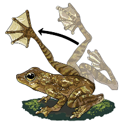

## About this resource

{fig-align="center" width="280"}

This website is a bioinformatics resource for Mangiamele Lab members learning to do RNA-seq analysis for the frog *Staurois parvus*.

The workflow uses [nf-core](https://nf-co.re/), a community collection of standardized, reproducible Nextflow pipelines. The examples focus on `nf-core/rnaseq`, but the same general approach applies to other nf-core workflows.

Visit the [Mangiamele Lab website](https://www.science.smith.edu/mangiamele/) for more information about the lab and its research.

Maintained by Katarina Flöer.

::: {.callout-note}
This tutorial is currently optimized for Mac users. Windows and Linux users can still follow the overall workflow, but some terminal commands or setup steps may differ.
:::

::: {.callout-tip}
Use this site as a practical guide for setting up a workspace, running the pipeline, checking results, and troubleshooting common issues.
:::

## Tutorial path (needs updating)

1. [Set up your environment](setup.qmd)
2. [Run the pipeline](running.qmd)
3. [Understand the results](results.qmd)
4. [Fix common issues](troubleshooting.qmd)

## Prerequisites

You will need:

- Lisa to register your email with Unity
- A laptop with a terminal 

## Citation and credit

This tutorial uses community tools from [nf-core](https://nf-co.re/) and [Nextflow](https://www.nextflow.io/). 
