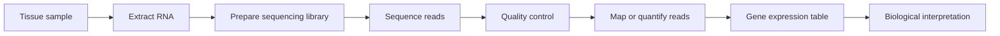
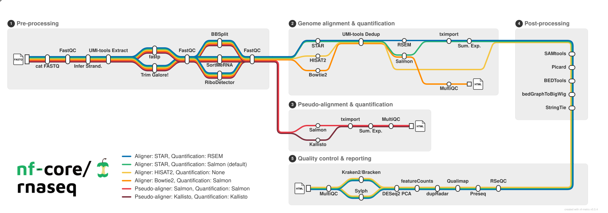

## The big idea

RNA-seq is a way to measure which genes are being expressed in a biological sample.

Cells use DNA as the long-term instruction manual, but they do not use every gene all the time. When a gene is active, the cell often makes RNA copies of that gene. RNA-seq lets us sequence those RNA molecules and estimate which genes were active, and how strongly, in each sample.

In this tutorial, we are interested in RNA-seq analysis for the frog *Staurois parvus*.

## From tissue to data

Conceptually, RNA-seq looks like this:



The wet lab steps produce sequencing files. The computational steps turn those files into quality-control reports and expression estimates.

## What are FASTQ files?

Sequencing machines produce reads. A read is a short sequence from an RNA molecule. These reads are usually stored in FASTQ files.

FASTQ files often come in pairs:

```text
sample1_R1.fastq.gz
sample1_R2.fastq.gz
```

For paired-end sequencing:

- `R1` contains the first read from each fragment
- `R2` contains the second read from each fragment
- `.gz` means the file is compressed

## What does the pipeline do?

An RNA-seq pipeline usually performs steps like:

- Check read quality
- Trim adapters or low-quality sequence, if needed
- Align reads to a genome or transcriptome
- Count or quantify gene/transcript expression
- Summarize quality-control metrics
- Save reports and reproducibility information

In this tutorial, we use `nf-core/rnaseq` to run these steps in a standardized and reproducible way.

The nf-core/rnaseq pipeline can be visualized as a "metro map" of analysis steps. Each stop represents a tool or processing step, and each colored route represents a different analysis path through the pipeline.

{fig-align="center" width="100%"}

Source: [nf-core/rnaseq version 3.26.0](https://nf-co.re/rnaseq/3.26.0/).

## What do we get at the end?

The main outputs are:

- Quality-control reports
- Alignment or mapping summaries
- Gene or transcript expression estimates
- Pipeline logs and software version information

These outputs help answer questions such as:

- Did the sequencing work well?
- Are any samples low quality or unusual?
- Which genes are expressed in each sample?
- Which samples are ready for downstream analysis?

## What RNA-seq does not tell us by itself

RNA-seq measures RNA abundance, not every part of biology directly. Gene expression can suggest biological patterns, but interpretation depends on experimental design, replication, annotation quality, and downstream statistics.

::: {.callout-note}
Good RNA-seq analysis starts before sequencing. Sample design, metadata, replication, and careful record keeping matter just as much as the computational pipeline.
:::
